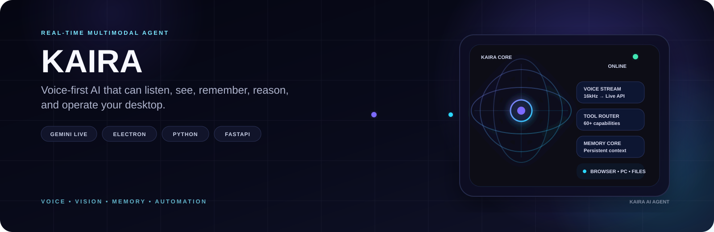
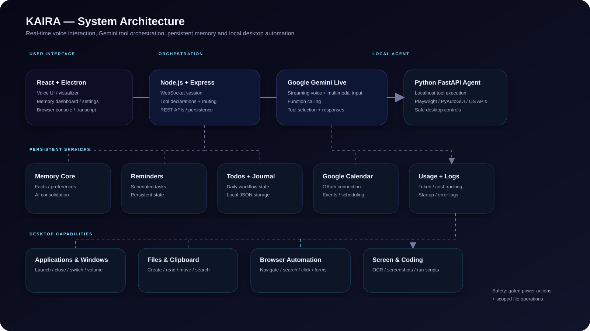

<p align="center">
  
</p>

<h1 align="center">KAIRA — AI Desktop Agent</h1>

<p align="center"><strong>A real-time multimodal AI companion that can listen, see, remember, reason, and operate a Windows desktop.</strong></p>

## Overview

KAIRA combines a voice-first React/Electron interface, Google Gemini Live, a Node.js orchestration layer, and a local Python FastAPI agent into a single desktop AI system.

It can:

- hold low-latency voice conversations with Gemini Live
- execute structured tools through Gemini function calling
- control Windows applications, windows, volume and system state
- manage files and clipboard content
- automate a Chromium browser with Playwright
- capture screenshots and read visible screen content with OCR
- create and run coding files/scripts
- maintain persistent memories, reminders, todos and journal entries
- connect to Google Calendar through OAuth
- track model usage and maintain local operational logs

> **Status:** Active development. APIs, tools and architecture may continue to evolve.

## Architecture

<p align="center">
  
</p>

### Runtime flow

```text
User voice / UI
      │
      ▼
React + Electron
      │
      ▼
Node.js / Express + WebSocket
      │
      ▼
Google Gemini Live
      │
      ├── built-in application services
      │     ├── memory
      │     ├── reminders / todos / journal
      │     ├── Google Calendar
      │     └── usage / logs
      │
      └── desktop function calls
            │
            ▼
      Python FastAPI agent
            │
            ├── Windows APIs
            ├── Playwright
            ├── PyAutoGUI / pywin32
            ├── OCR
            └── local filesystem
```

The Node layer acts as the orchestration boundary. Gemini selects declared tools; server-side tools are handled directly, while desktop capabilities are forwarded to the localhost Python agent over HTTP.

## Core Capabilities

### Multimodal voice interaction

The frontend streams microphone PCM audio to the Gemini Live session and plays model audio responses in real time. The audio layer also exposes analyser data for the live visualizer and supports interruption of active playback.

### Tool-driven desktop automation

KAIRA exposes a structured tool registry covering:

- applications and websites
- windows and volume
- files and folders
- clipboard operations
- screenshots and screen reading
- browser automation
- coding assistance
- system and GPU information
- brightness and Windows auto-start

The Python agent keeps shared Playwright/browser state in a controlled process-level state object and exposes a small HTTP API for tool execution.

### Persistent memory

KAIRA stores durable user information by category and uses Gemini to consolidate conversation slices into `ADD`, `UPDATE`, and `REMOVE` memory transactions. The memory system is designed to ignore routine small talk and retain durable facts, preferences, goals and projects.

### Safety boundaries

Sensitive desktop operations are not treated as ordinary tool calls. Power actions use a two-step confirmation token flow, file operations are scoped to approved locations, and script execution has a configurable timeout.

## Tech Stack

| Layer | Technologies |
| --- | --- |
| UI | React, TypeScript, Vite, Tailwind CSS |
| Desktop shell | Electron |
| Backend | Node.js, Express, WebSocket |
| AI | Google Gemini Live API |
| Desktop agent | Python, FastAPI |
| Browser automation | Playwright |
| Desktop automation | PyAutoGUI, pywin32, psutil |
| OCR | Tesseract / pytesseract |
| Calendar | Google Calendar OAuth |
| State | Local JSON-backed persistence |
| Build | electron-builder |

## Project Structure

```text
.
├── src/                        # React application and UI state
│   ├── components/             # Visualizer, browser, memory, settings, transcript UI
│   └── lib/                    # Audio, wake word and client-side state
├── electron/                   # Electron main process, preload and splash screen
├── desktop_agent/              # Python FastAPI desktop-control service
│   ├── tools_*.py              # Desktop, browser, file, system and coding tools
│   └── registry.py              # Tool registry and shared execution state
├── server.ts                   # Node orchestration server and Gemini Live session
├── server_tool_declarations.ts # Gemini function declarations
├── server_desktop_agent.ts     # Node → Python desktop-agent bridge
├── server_memory.ts             # Persistent memory + consolidation
├── server_calendar.ts           # Google Calendar integration
├── server_reminders.ts          # Reminder scheduling
├── server_todos.ts              # Todo persistence
├── server_journal.ts             # Journal persistence
├── server_usage.ts               # Usage tracking
└── electron-builder.yml         # Desktop packaging configuration
```

## Getting Started

### Prerequisites

- Windows 10/11
- Node.js 20+
- Python 3.11+
- A Google Gemini API key
- Chromium for Playwright browser automation
- Tesseract OCR is optional for screen-reading features

### Install

```bash
git clone https://github.com/Zephyrex21/kaira-ai-agent.git
cd kaira-ai-agent

npm install
python -m pip install -r desktop_agent/requirements.txt
python -m playwright install chromium
```

Create `.env` from `.env.example` and configure the required credentials. KAIRA also supports supplying the Gemini key through its Settings UI; the key is stored locally and is never returned by the configuration endpoint.

### Development

Start the Node/React application and the Python desktop agent separately:

```bash
npm run dev
```

```bash
python -m desktop_agent.main
```

The desktop agent listens on `127.0.0.1:8765` by default.

## Safety Model

KAIRA is designed around explicit boundaries for local automation:

- shutdown, restart, sleep and lock require a short-lived confirmation token
- file operations are restricted to approved folders
- destructive file deletion uses the Recycle Bin by default
- Python execution has a configurable timeout
- desktop-agent communication is local by default
- tool handlers return structured success/error results to the orchestrator

## Development

The repository includes GitHub Actions type checking and a modular separation between UI, orchestration, AI tool declarations, persistent services and the Python desktop agent.

Before opening a pull request, verify the TypeScript project with the repository's configured typecheck workflow.

## Roadmap

KAIRA is actively evolving. The current architecture is intentionally modular so new capabilities can be added as server-side tools or Python desktop tools without changing the core voice session.

Potential future directions include broader multimodal perception, richer automation workflows, stronger permission controls, additional integrations and improved packaging/distribution.

## License

No license file is currently included in the repository. Add a `LICENSE` file before describing the project as MIT-licensed or granting explicit reuse permissions.

---

<p align="center">Built as an evolving experiment in multimodal AI, desktop agents and tool-driven automation.</p>
